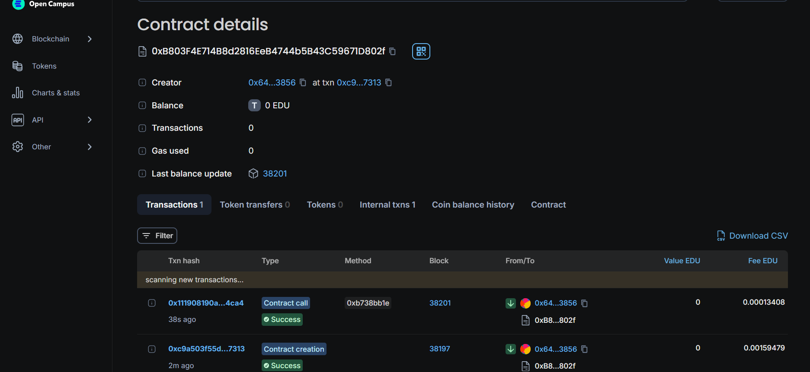

# CourseCredit Smart Contract

This Solidity smart contract allows the issuance, transfer, and verification of academic course credits on the Ethereum blockchain. The contract is designed to facilitate the recognition and transfer of course credits between institutions, providing a decentralized and secure way to manage academic achievements.

## Features

- **Issue Credits:** Academic institutions can issue course credits to students, recording details such as the course name, issuing institution, and credit hours.
- **Transfer Credits:** Students can transfer their course credits to other students or institutions, enabling recognition of academic achievements across different educational bodies.
- **View Credits:** Students and institutions can view the list of credits associated with a particular student address.
- **Verify Credits:** Anyone can verify the details of a specific course credit using its unique ID.
- **Credit Ownership:** The ownership of credits is tracked, ensuring that only the rightful owner can transfer a credit.

## Contract Structure

### Structs

- `Credit`: A struct representing a course credit, containing the following fields:
  - `id`: The unique identifier of the credit.
  - `courseName`: The name of the course associated with the credit.
  - `issuingInstitution`: The institution that issued the credit.
  - `creditHours`: The number of credit hours associated with the course.
  - `isTransferred`: A boolean indicating whether the credit has been transferred.

### Mappings

- `studentCredits`: A mapping from a student's address to an array of their course credits.
- `creditToOwner`: A mapping from a credit's unique ID to the address of its owner.

### Events

- `CreditIssued`: Emitted when a new course credit is issued.
- `CreditTransferred`: Emitted when a course credit is transferred from one student to another.

### Functions

- **`issueCredit(address student, string memory courseName, string memory issuingInstitution, uint256 creditHours)`**: Issues a new course credit to a student.
- **`transferCredit(uint256 creditId, address to)`**: Transfers a course credit from the current owner to another address.
- **`viewCredits(address student)`**: Returns the list of course credits associated with a given student address.
- **`verifyCredit(uint256 creditId)`**: Verifies and returns the details of a specific course credit, including the course name, issuing institution, credit hours, and current owner.
- **`getCreditOwner(uint256 creditId)`**: Returns the owner of a specific course credit.

## Usage

### Deploying the Contract

To deploy the contract, you can use any Solidity-compatible development environment such as [Remix](https://remix.ethereum.org/) or a local environment with [Hardhat](https://hardhat.org/) or [Truffle](https://www.trufflesuite.com/).

## Developer Details

- *Project Lead*: [Shiwang Khera](mailto:yobro3366@gmail.com)
- *Contact*: [Email](mailto:your.email@example.com)
- *GitHub*: [GitHub Profile](https://github.com/DarkMatterCompiler)

---

Thank you for checking out CourseCredit Smart Contract! We are excited to bring innovation to diploma issuance and look forward to contributing to the future of education technology.

contract address:0xb803f4e714b8d2816eeb4744b5b43c59671d802f

